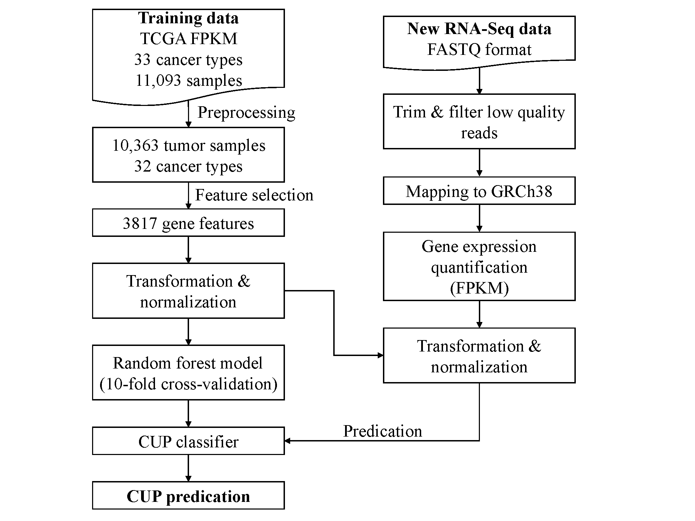

# TRANSCUP 

Cancer of unknown primary site (CUP) accounts for 5% of all cancer diagnoses. These patients may benefit from more precise treatment when primary cancer site was identified. Advances in high-throughput sequencing have enabled cost-effective sequencing the transcriptome for clinical application. Here, we present a free, scalable and extendable software for CUP predication called TRANSCUP, which enables (1) raw data processing, (2) read mapping, (3) quality report, (4) gene expression quantification, (5) random forest machine learning model building for cancer type clas-sification. TRANSCUP achieved high accuracy, sensitivity and specificity for tumor type classifica-tion based on external RNA-seq datasets. It has potential for broad clinical application for solving the CUP problem.

# WORKFLOW

# INSTALL
## Requirments
* R >=3.4
* python 3
### Python packages

* snakemake>=5.5.2
* bx-python>=0.8.2
* HTSeq>=0.11.2
* numpy>=1.17.0
* pandas>=0.25.0
* argparse>=1.4.0

### R packages
* GenomicFeatures>=1.34.3
* dplyr>=0.8.0.1
* optparse>=1.6.1
* randomForest>=4.6.14
* caret>=6.0.81
* e1071>=1.7.0.1
* data.table>=1.12.0
* regexPipes>=0.0.1
* TCGAbiolinks>=2.12.3
* DT>=0.5
* splitstackshape>=1.4.8
* mlbench>=2.1.1
* doParallel>=1.0.14

### Public softwares
* [STAR](https://github.com/alexdobin/STAR/archive/2.6.1c.tar.gz)
* [FastQC](https://www.bioinformatics.babraham.ac.uk/projects/fastqc/fastqc_v0.11.8.zip)
* [rnaseqc](https://github.com/broadinstitute/rnaseqc/releases/download/v2.3.4/rnaseqc.v2.3.4.linux.gz)
* [samtools](https://github.com/samtools/samtools/releases/download/1.9/samtools-1.9.tar.bz2)
* [Trimmomatic](http://www.usadellab.org/cms/uploads/supplementary/Trimmomatic/Trimmomatic-0.39.zip)

### Database
* [GRCh38 Fasta file](https://api.gdc.cancer.gov/data/254f697d-310d-4d7d-a27b-27fbf767a834)
* [Gencode V22 GTF](https://api.gdc.cancer.gov/data/25aa497c-e615-4cb7-8751-71f744f9691f)

## Build STAR index
<pre>

STAR \
--runMode genomeGenerate \
--genomeDir ./star_index_genecodev22 \
--genomeFastaFiles ./GRCh38.d1.vd1.fa \
--sjdbOverhang 100 \
--sjdbGTFfile ./gencode.v22.annotation.gtf \
--runThreadN 48

</pre>

## Collapse gtf file

<pre>
python3 ./pipeline/gene_model/collapse_annotation.py gencode.v22.annotation.gtf gencode.v22.annotation.collapse.gtf
</pre>

## Calculate the gene length

<pre>
Rscript ./pipeline/gene_length_info.R gencode.v22.annotation.gtf gene_length_genecode_v22.tsv
</pre>

## Prepare config file

**database.software.resource.json**

This json file contains the database file path and software path. 
<pre>
./config/database.software.resource.json
</pre>

**slurm.cluster.resource.json** 

This file contains the SLURM cluster config information, when run TRANSCUP locally, you can ignore this file.
<pre>
./config/slurm.cluster.resource.json
</pre>

# USAGE EXAMPLE

## Prepare a sample sheet file

<pre>
./example/sample_sheet.txt
</pre>

## Prepare data
<pre>
python prepare_data.py \
	--sample_sheet ./example/sample_sheet.txt
	--seq_type PE \
	--out_dir ./example/fq_in
</pre>

## Make a Snakefile

<pre>
python ./transcup.py \
	--fq_dir ./example/fq_in \
	--config ./config/database.software.resource.json \
	--cluster_config ./config/slurm.cluster.resource.json \
	--out_dir ./example
</pre>

## Run locally
<pre>
nohup sh RUN_local.sh > log.local &
</pre>

## Run on SLURM cluster
<pre>
nohup sh RUN_slurm_cluster.sh > log.slurm &
</pre>

## Run on SGE cluster
<pre>
nohup sh RUN_SGE_cluster.sh > log.sge &
</pre>

# BUILDING MODEL
<pre>
cd model_build
# download TCGA training data and preprocess data
cd preprocess
Rscript 01_download_TCGA_RNA_seq_data.R
Rscript 02_parse_fpkm_files.R
Rscript 03_cat_all_clinical_info.R
Rscript 04_filter_normal_samples.R
Rscript 05_feature_selection.R
Rscript 06_make_R_dataset.R

# Build a random forest model
cd ../random_forest

## train tuning to select an ideal  hyper-parameter
Rscript train_cross_validation.R
</pre>

# CONTACT
### **Peng Li** <peng-li@outlook.com>